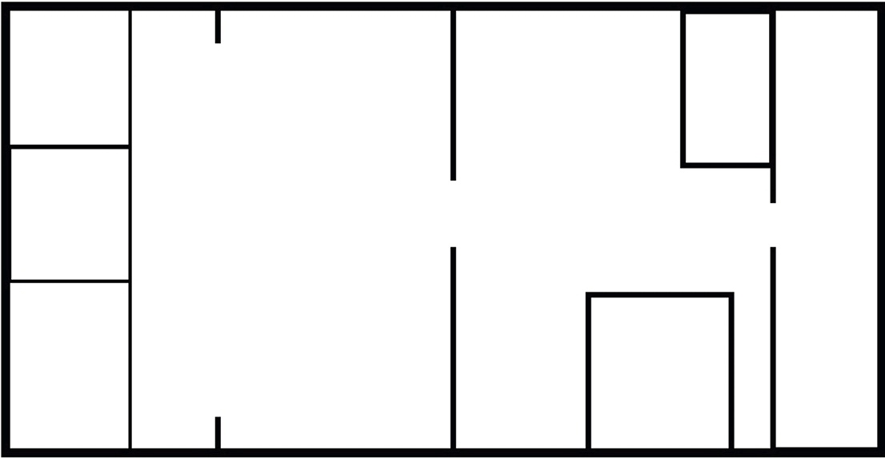
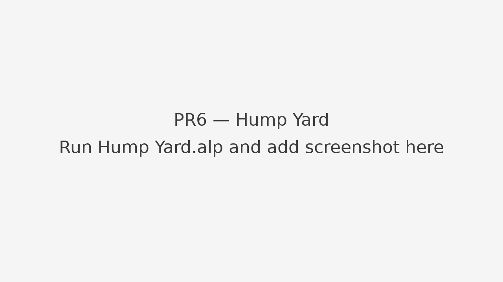
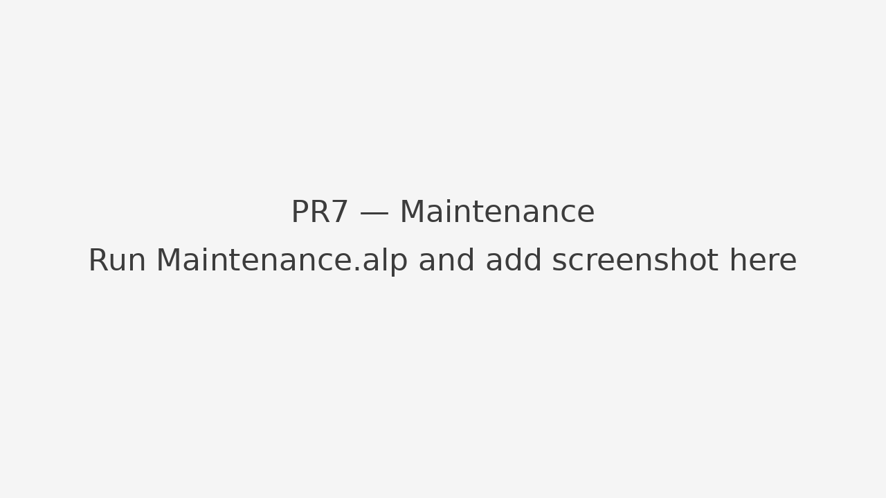
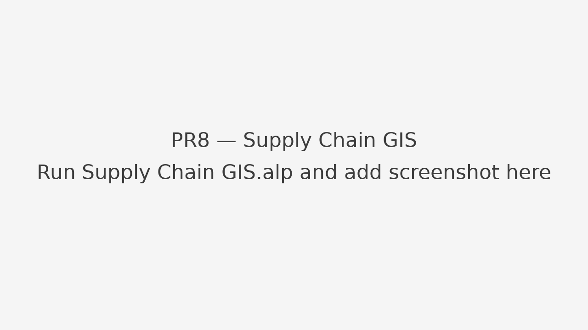
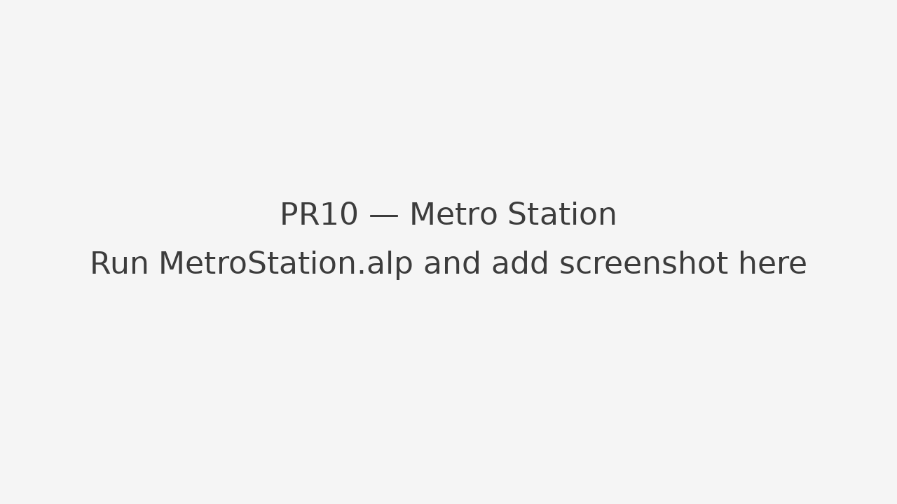

# System Simulation Models — AnyLogic

> Collection of discrete-event, agent-based and multi-method simulation models built with AnyLogic for logistics, transport, service systems and production processes.

## Overview

This repository contains 10 practical simulation projects developed with **AnyLogic**. The models cover queueing systems, manufacturing, transport, pedestrian flow, maintenance, GIS-based supply chain simulation and production systems.

**Context:** Applied Systems Simulation course — RTU MIREA / MADI, 2024–2025.

## Project Portfolio

| # | Project | Model file | Domain | Screenshot |
|---|---|---|---|---|
| PR1 | Bank Queue | `projects/PR1_Bank_Queue/Bank1.alp` | Service operations | `assets/pr1_bank_queue.png` |
| PR2 | Job Shop | `projects/PR2_Job_Shop/Job Shop.alp` | Manufacturing / logistics | `assets/pr2_job_shop.png` |
| PR3 | Ice Cream Production | `projects/PR3_Ice_Cream_Production/IceCream.alp` | Production process | `assets/pr3_ice_cream.jpg` |
| PR4 | Subway Entrance Hall | `projects/PR4_Subway_Entrance_Hall/Subway Entrance Hall.alp` | Pedestrian flow | `assets/pr4_subway_entrance_hall.png` |
| PR5 | Road Traffic Tutorial | `projects/PR5_Road_Traffic_Tutorial/Road Traffic Tutorial.alp` | Road traffic | `assets/pr5_road_traffic.png` |
| PR6 | Hump Yard | `projects/PR6_Hump_Yard/Hump Yard.alp` | Rail logistics | `assets/pr6_hump_yard.png` |
| PR7 | Maintenance | `projects/PR7_Maintenance/Maintenance.alp` | Maintenance operations | `assets/pr7_maintenance.png` |
| PR8 | Supply Chain GIS | `projects/PR8_Supply_Chain_GIS/Supply Chain GIS.alp` | GIS / supply chain | `assets/pr8_supply_chain_gis.png` |
| PR9 | Lead Acid Battery Production | `projects/PR9_Lead_Acid_Battery_Production/Lead Acid Battery Production.alp` | Industrial production | `assets/pr9_battery_production_1.jpg` |
| PR10 | Metro Station | `projects/PR10_Metro_Station/MetroStation.alp` | Passenger flow | `assets/pr10_metro_station.png` |

## Screenshots

### PR1 — Bank Queue

### PR2 — Job Shop

### PR4 — Subway Entrance Hall

### PR5 — Road Traffic

### PR9 — Lead Acid Battery Production

### PR3 — Ice Cream Production *(à ajouter — voir section suivante)*

### PR6 — Hump Yard *(à ajouter)*

### PR7 — Maintenance *(à ajouter)*

### PR8 — Supply Chain GIS *(à ajouter)*

### PR10 — Metro Station *(à ajouter)*

## How to Run

1. Install **AnyLogic Personal Learning Edition** or AnyLogic Professional.
2. Open one of the `.alp` files from the `projects/` folder.
3. Click **Run** in the AnyLogic IDE.
4. Use the model interface to change parameters and observe results.

## Suggested Online Execution / Capture Workflow

There is no way to render `.alp` files into images without opening AnyLogic at least once — they're proprietary project files that only the AnyLogic engine can parse. AnyLogic Cloud (free, online, shareable links) exists, but it still requires exporting from the desktop IDE first; it doesn't remove the need to open the app. The free **Personal Learning Edition** (PLE) is enough for all of this, no purchase needed.

1. Open the `.alp` file in AnyLogic PLE.
2. Click **Run**, let the animation play for a bit so the view isn't empty (queues filled, agents moving, a few units produced).
3. Capture the main animation/results screen (Windows: `Win+Shift+S`; the AnyLogic "Export view as picture" option under the model's right-click menu also works and gives a cleaner crop).
4. Save the image in `assets/` using the filename already listed in the table above (so the existing `![...]` links in this README start working automatically).
5. Commit and push.

**Still missing — 5 to go:**

| # | Project | What to watch for |
|---|---|---|
| PR3 | Ice Cream Production | Let it run until at least one batch reaches the packaging stage so the process flow isn't just empty conveyors. |
| PR6 | Hump Yard | Capture once a few wagons are mid-classification — an empty yard doesn't show much. |
| PR7 | Maintenance | Trigger at least one failure/repair cycle before capturing, otherwise all machines look idle/identical. |
| PR8 | Supply Chain GIS | Needs an internet connection *inside the AnyLogic session* to load the OpenStreetMap base map — if the map tiles are blank/gray, check your connection before capturing. |
| PR10 | Metro Station | Capture during a peak inflow moment so the pedestrian density is visible, not an empty platform. |

If you'd rather not fiddle with the README yourself: run the 5 models, send me the screenshots (or just paste them in chat), and I'll drop them into the table/sections above with the right sizing and captions.

## Technologies

- AnyLogic 8.x
- Java scripting inside AnyLogic
- Discrete-event simulation
- Agent-based modeling
- GIS-based modeling
- Process and production system simulation

## Skills Demonstrated

- Queueing and service-system modeling
- Manufacturing process simulation
- Logistics and transport modeling
- Pedestrian and passenger-flow simulation
- GIS-based supply chain simulation
- Operations research and scenario analysis

## Author

**Manassé Makuikila Lusaku**  
Master's in Integrated Automated Control Systems — MADI, Moscow

## License

MIT License
